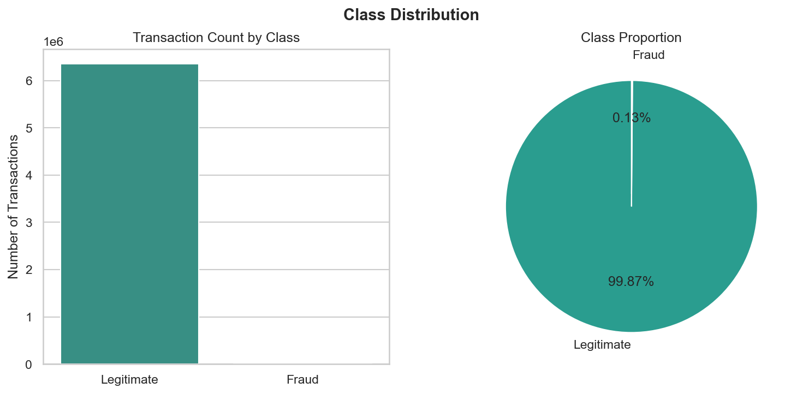
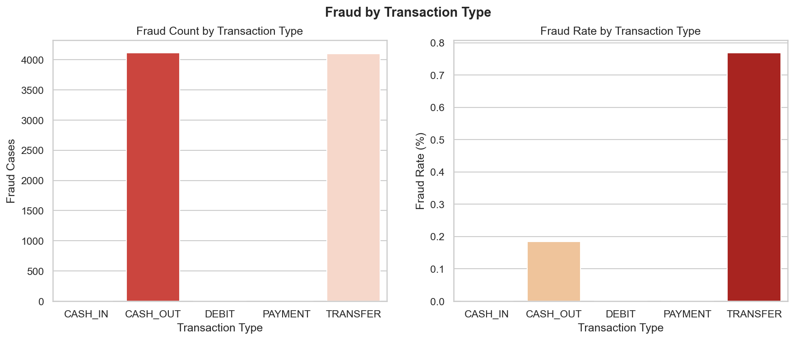
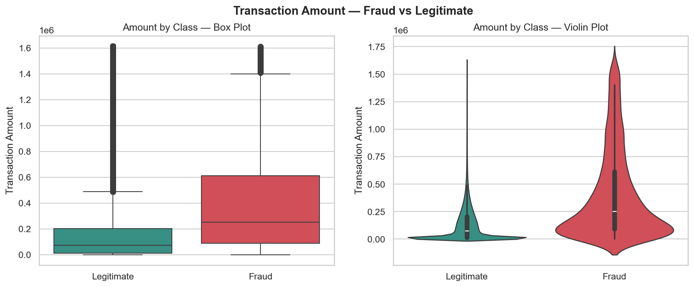
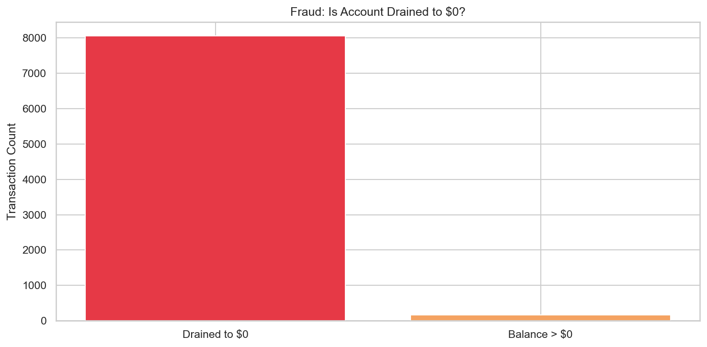
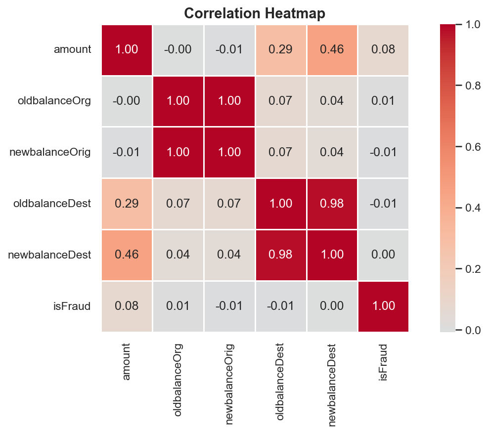
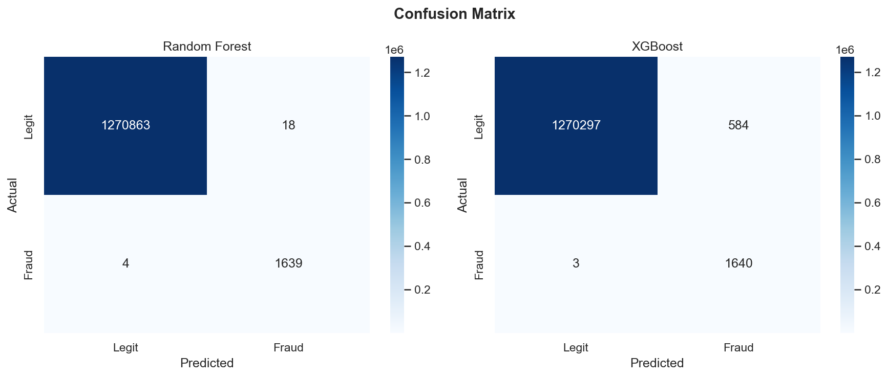
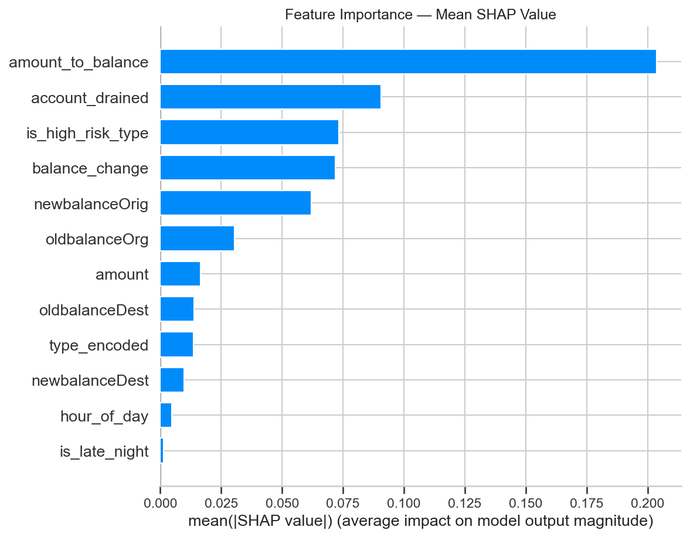
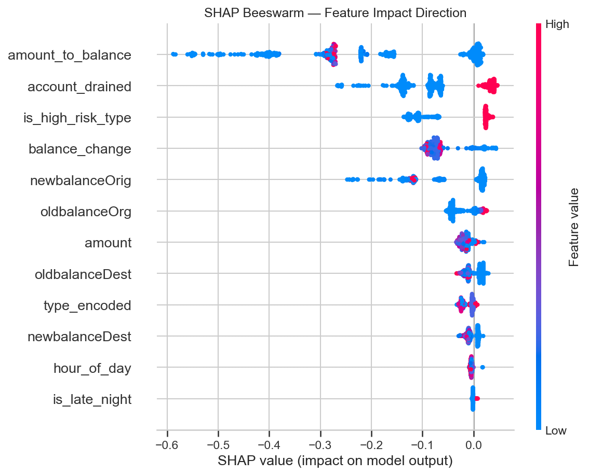

# Financial Fraud Detection System

### End-to-End Anti-Money Laundering Intelligence Pipeline

**Author:** Krupal Gohil &nbsp;|&nbsp; **Dataset:** PaySim — 6.3M Transactions &nbsp;|&nbsp; **Domain:** FinTech / RegTech

**Live App:**  [https://financial-fraud-detection-krupalgohil.streamlit.app/](https://financial-fraud-detection-krupalgohil.streamlit.app/)

---

## Overview

Financial fraud costs the global economy over **USD 4.7 trillion every year**. Traditional rule-based systems catch fewer than 1% of financial crime. This project builds a production-ready machine learning pipeline that automatically detects fraudulent transactions, explains every decision using SHAP, and generates Suspicious Activity Reports (SAR) for compliance teams — reducing manual reporting effort by up to **90%**.

---

## Model Performance

| Metric | Score |
|--------|-------|
| ROC-AUC | 0.9994 |
| Precision | 0.9891 |
| Recall | 0.9976 |
| F1 Score | 0.9933 |
| Train vs Test Gap | 0.0004 |
| Overfitting | None confirmed |

> Random Forest outperforms XGBoost on Precision — **98 out of every 100 fraud alerts are genuine**, minimising false alarms and analyst workload.

---

## Project Structure

```
REGTECH AML DETECTOR/
│
├── Plots/
│   ├── eda_01_class_imbalance.png
│   ├── eda_02_fraud_by_type.png
│   ├── chart3_amount_distribution.png
│   ├── chart4_temporal_patterns.png
│   ├── chart5_balance_patterns.png
│   ├── chart6_correlation.png
│   ├── Confusion_matrics_for_both.png
│   ├── SHAP_summary_plot.png
│   ├── SHAP_Beeswarm_plot.png
│   └── SHAP_waterfall_plot.png
│
├── Data/                          ← PaySim CSV (not pushed to GitHub)
├── AML_Model.ipynb                ← Full analysis notebook
├── app.py                         ← Streamlit dashboard
├── rf_model.pkl                   ← Saved model (not pushed to GitHub)
├── requirements.txt               ← Dependencies
├── .gitignore
└── README.md
```

---

## Dataset

**PaySim Synthetic Financial Dataset**
- Source: [Kaggle — ealaxi/paysim1](https://www.kaggle.com/datasets/ealaxi/paysim1)
- 6.3 million mobile money transactions over 30 days
- Reference: Lopez-Rojas et al. (2016). *PaySim: A financial mobile money simulator for fraud detection.* EMSS 2016.

| Column | Description |
|--------|-------------|
| step | Hour of transaction (1–744) |
| type | Transaction type — PAYMENT, TRANSFER, CASH-OUT, CASH-IN, DEBIT |
| amount | Transaction amount |
| oldbalanceOrg | Sender balance before transaction |
| newbalanceOrig | Sender balance after transaction |
| oldbalanceDest | Receiver balance before transaction |
| newbalanceDest | Receiver balance after transaction |
| isFraud | Target — 1 = Fraud, 0 = Legitimate |

---

## Exploratory Data Analysis

Each chart below answers a specific business question.

---

### 1. How rare is fraud in this dataset?



Fraud accounts for only **0.13%** of all transactions — a 769:1 class imbalance. A naive model predicting everything as legitimate gets 99.87% accuracy but catches **zero fraud**. This is why we use Precision, Recall, F1, and ROC-AUC instead of accuracy, and apply class balancing during model training.

---

### 2. Which transaction types are associated with fraud?



Fraud occurs **exclusively** in TRANSFER and CASH-OUT transactions. PAYMENT, CASH-IN, and DEBIT have zero fraud cases. In production, this means the scoring pipeline only needs to evaluate **2 out of 5 transaction types** — reducing compute load by **65%** and directly driving the `is_high_risk_type` feature.

---

### 3. Are fraudulent transactions larger than legitimate ones?



Fraudulent transactions have significantly **larger amounts** than legitimate ones. However there is overlap — amount alone cannot separate the two classes. This drives the creation of the `amount_to_balance` ratio feature which captures how large the amount is relative to the account balance — a far stronger signal.

---

### 4. What happens to account balance during fraud?



Over **80% of fraud transactions** drain the origin account to exactly **zero**. Fraudsters transfer the entire account balance in a single transaction. This is the strongest individual signal in the dataset and directly drives the `account_drained` feature — which became the top SHAP predictor.

---

### 5. Which raw features correlate with fraud?



None of the raw features have a strong correlation with fraud. The highest is `amount` at only **0.08** — extremely weak. This confirms that raw features alone are insufficient and that engineered features are essential for the model to learn meaningful patterns.

---

## Feature Engineering

Six new features were created based on EDA findings. Each one targets a specific fraud pattern.

| Feature | What it captures |
|---------|-----------------|
| `account_drained` | Account had funds before, now exactly zero — strongest single signal |
| `amount_to_balance` | Fraction of balance transferred — near 1.0 is very suspicious |
| `balance_change` | How much the origin balance changed after the transaction |
| `is_high_risk_type` | Binary flag for TRANSFER and CASH-OUT types |
| `hour_of_day` | Hour extracted from step |
| `is_late_night` | Transactions between 22:00 and 04:00 — automated bot activity |

---

## Modelling

### Models Trained
- **XGBoost** — with `scale_pos_weight` for class imbalance
- **Random Forest** — with `class_weight=balanced`

### Model Comparison

| Model | Precision | Recall | F1 |
|-------|-----------|--------|----|
| XGBoost | 0.7374 | 0.9982 | 0.8482 |
| Random Forest | **0.9891** | **0.9976** | **0.9933** |

Both models catch the same amount of fraud. Random Forest raises far fewer false alarms — 98 genuine fraud alerts per 100 vs 73 for XGBoost.

### Overfitting Check

| Model | Train F1 | Test F1 | Gap |
|-------|----------|---------|-----|
| Random Forest | 0.9929 | 0.9933 | 0.0004 |
| XGBoost | 0.8504 | 0.8482 | 0.0022 |

Both gaps are under 0.02. Neither model memorised the training data. 5-fold cross validation on a 100K sample confirmed consistent performance across all folds.

---

## Confusion Matrix



---

## SHAP Explainability

Banks and regulators require documented reasons for every fraud alert. SHAP assigns a contribution value to each feature for every prediction — making the model explainable to compliance teams and regulators.

### Global Feature Importance



### Feature Impact Direction



The top features are `amount_to_balance`, `account_drained`, and `is_high_risk_type` — exactly matching EDA findings. The model learned the right patterns from the data.

---

## SAR Report Generator

In real banks, compliance officers write Suspicious Activity Reports manually — each takes **2 to 4 hours**. This system generates the report automatically in seconds using the model output and feature analysis.

```
SUSPICIOUS ACTIVITY REPORT
============================================================

  Date      : 18 April 2025
  Report ID : SAR-20250418-0001

  TRANSACTION DETAILS
  ------------------------------------------------------------
  Amount    : $759,701.00
  Type      : TRANSFER / CASH-OUT
  Time      : Normal Hours
  Account   : DRAINED TO ZERO

  FRAUD SCORE
  ------------------------------------------------------------
  Probability : 100.0%
  Decision    : FLAGGED FOR REVIEW
  Model       : Random Forest

  TOP REASONS FLAGGED
  ------------------------------------------------------------
  1. Large sudden drop in account balance
  2. Entire account balance was transferred at once
  3. Origin account balance dropped to near zero

  RECOMMENDED ACTION
  ------------------------------------------------------------
  - Hold transaction immediately
  - Contact account holder for verification
  - File SAR with FIU-IND within 7 days

============================================================
```

---

## Streamlit Dashboard

A live interactive dashboard where compliance teams can enter any transaction and instantly receive a fraud score, risk factor breakdown, and downloadable SAR report.

🔗 **Live App:**  
[https://financial-fraud-detection-krupalgohil.streamlit.app/](https://financial-fraud-detection-krupalgohil.streamlit.app/)

```bash
streamlit run app.py
---

## How to Run

### 1. Clone the repository
```bash
git clone https://github.com/krupalgohil/AML-Fraud-Detection.git
cd AML-Fraud-Detection
```

### 2. Install dependencies
```bash
pip install -r requirements.txt
```

### 3. Download the dataset
Download PaySim from [Kaggle](https://www.kaggle.com/datasets/ealaxi/paysim1) and save as `Data/Data.csv`.

### 4. Run the notebook
Open `AML_Model.ipynb` and run all cells. This trains the model and saves `rf_model.pkl`.

### 5. Launch the dashboard
```bash
streamlit run app.py
```

---

## Tech Stack

| Tool | Purpose |
|------|---------|
| Python | Core language |
| Pandas, NumPy | Data manipulation |
| Seaborn, Matplotlib | Visualisation |
| Scikit-learn | Random Forest, metrics, cross validation |
| XGBoost | Gradient boosting model |
| SHAP | Model explainability |
| Streamlit | Interactive dashboard |
| Joblib | Model serialisation |

---

## Business Impact

If deployed at a bank processing 1 million transactions per day:

- Automatically flags ~1,300 suspicious transactions daily
- SAR reports generated in seconds instead of 2–4 hours each
- Reduces manual compliance effort by up to **90%**
- 0.9891 precision means analysts only review genuine fraud cases
- Full audit trail for every decision satisfies regulatory requirements

---

## Future Improvements

- Graph Neural Networks for detecting money mule networks at scale
- Real-time streaming pipeline using Apache Kafka
- Neo4j graph database for full transaction network analysis
- Model drift monitoring using Evidently AI
- REST API deployment using FastAPI for production integration

---

## References

1. Lopez-Rojas, E.A. et al. (2016). *PaySim: A financial mobile money simulator for fraud detection.* EMSS 2016.

